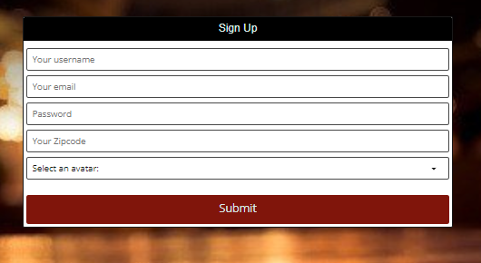
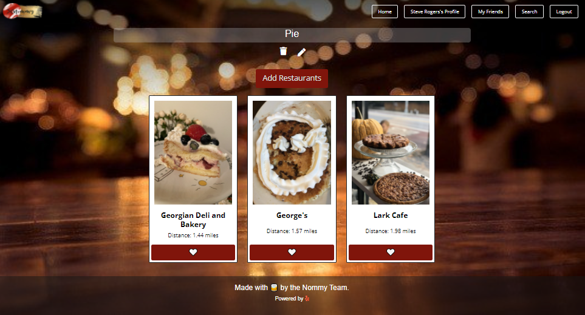

# Nommy

A place to save all your restaurant dining ideas and to get inspired.
## Licensing:

## Table of Contents
* [User Story](#UserStory)
* [Installation](#Installation)
* [Usage](#Usage)
* [Technologies](#Technologies)
* [Next Steps](#Technologies)
* [Contributors](#Contributors)
* [Contact](#Contact)
* [Links](#Links)

## User Story 
* As a foodie 
* I WANT to search for new restaurants to check out
* SO THAT I can keep and organize a list of places that I want to try 
## Acceptance Criteria 
* GIVEN a restaurant search app
* WHEN I load the app
* THEN I am presented with a homepage with options to search for restaurants, login or signup, 
* and random user's saved restaurants
* WHEN I click on search for restaurants
* THEN I am redirected to login/signup and then will be able to search
* WHEN I click on login or signup
* THEN I am redirected to login/signup
* WHEN I click on a user's saved restaurants
* THEN I am redirected to login/signup and then will be sent to the user's slate of restaurants
* WHEN I click on login 
* THEN I am presented with a form to enter my email and password
* THEN I submit the login form
* THEN I am redirected to my logged in homepage containing a random list of suggested restaurants
* WHEN I click on signup
* THEN I am presented with a form to enter my username, email, password, and select from a list of avatars
* WHEN I submit the signup form
* THEN I am redirected to my logged in homepage containing a random list of suggested restaurants
* WHEN I am on my logged in homepage
* THEN I am presented with the option to view my profile page or my friends list or log out
* WHEN I am on my profile page
* THEN I am presented with a view of all my slates containing a slate name and image and clickable to view the contents of the slate, and an add new slate button
* WHEN I click on a slate
* THEN I am presented with a view of all the restaurants in that slate including restaurant name, image, and clickable link to the restaurant
* WHEN click on add new slate button
* THEN I can add restaurants to that slate
* WHEN I click on my friends button
* THEN I am redirected to a list of my friends page with links to their profiles and a search for new friends button
* WHEN I click on a friend
* THEN I am redirected to their profile
* WHEN I click on the log out button
* THEN I am logged out

## Installation
Fork this repo and download the files to your local environment. Install the dependencies and create a .env file.

1. Fork the [repository](https://github.com/shelleymcq/nommy) from [GitHub](https://github.com/) to your profile.
2. Clone the repository down to your local machine in command-line using: `git clone`.
3. Node.js is required to run this application. Click [here](#installing-nodejs) for instructions on installing Node.js.
4. Install the required dependices to your cloned directory in command-line using: `npm install` and create a .env file to store your sensitive variables.

   - Or install the packages individually...
     - Install [graphql](https://www.npmjs.com/package/graphql) to your cloned directory in command-line using: `npm install graphql`.
     - Install [react-bootstrap](https://www.npmjs.com/package/react-bootstrap) to your cloned directory in command-line using: `npm install react-bootstrap`
     - Install [apollo-server-express](https://www.npmjs.com/package/apollo-server-express) to your cloned directory in command-line using: `npm install bcrypt`
     - Install [bcrypt](https://www.npmjs.com/package/bcrypt) to your cloned directory in command-line using: `npm install bcrypt`
     - Install [bootstrap](https://www.npmjs.com/package/bootstrap) to your cloned directory in command-line using: `npm install bootstrap`
     - Install [express](https://www.npmjs.com/package/express) to your cloned directory in command-line using: `npm install expresss`
     - Install [jsonwebtoken](https://www.npmjs.com/package/jsonwebtoken) to your cloned directory in command-line using: `npm install jsonwebtoken`
     - Install [mongoose](https://www.npmjs.com/package/mongoose) to your cloned directory in command-line using: `npm install mongoose`
     - Install [axios](https://www.npmjs.com/package/axios) to your cloned directory in command-line using: `npm install axios`

   ###### Installing Nodejs

   1. Check if you already have Node.js in command-line by typing `node`.
   2. If you have Node.js on your machine, a message similar to `Welcome to Node.js` will appear.
   3. If you do not have Node.js, an error message will appear and you need to download it.
   4. To download Node.js, click [here](https://nodejs.org/en/download/).
   5. After download and installation is complete, restart your command-line terminal and redo step 1 to confirm a successful installation.
   6. After Node.js is on your local machine, return to the [installation](#installation) instructions for this project's application above.

## Usage
_If cloned down to your computer..._

1. `Add an .env file with your MySQL username, database name, and MySQL password, gmail email address, and email password.`
2. Navigate to the directory of the application in your terminal using `cd`, if not already there.
3. If you haven't already, be sure you followed all [installation](#installation) installation instructions above.
4. Seed your database in CLI using: `npm run seed`.
5. Initialize the application in CLI using: `npm run develop`.
6. The react application will automatically load when the server starts.

_If accessing deployed Heroku application..._

1. View homepage welcome and intro.
2. Click Login to login or sign up.
3. View all tool categories on logged in homepage.
4. Click a category to view all tools in your neighborhood in that neighborhood.
5. Click a tool to view tool name, description, owner, and request to borrow button.
6. Click the "Request to Borrow" button to send an email to the tool's owner with templated request email.
7. Click "My Toolbox" to view all of your posted tools and the option to add a new tool.
8. Click Add a Tool to add a tool to your toolbox for other neighbors to request to borrow.
9. Click one of your tools in your toolbox to get the option to edit or delete the tool.
10. Click the edit tool button to update the tool's name, description or category.
11. Click the delete tool button to remove the tool from your toolbox and the site.
12. Click your neighborhood name in the navigation bar to view all tools available in your neighborhood.
13. Type and submit a term in the search bar to view all tools with a title or description containing that search term.
14. On an individual tool, click the tool owner's name to view all of that user's tools.
15. Logout to end your session and close access to your toolbox.

_Homepage (Logged out):_

_Login:_

_Signup:_

_Homepage (Logged in):_

_Profile:_

_Slate View:_

## Technologies
* Yelp Fusion API
* Mongoose
* Express
* React
* JavaScript
* Node.js
* Graphql
* React Bootstrap
* Axios
* Apollo Server Express
* Express.js
* MongoDB
* Bcrypt
* Jsonwebtoken
## Next Steps
* Ability to search for and add friends
* Add your address to you profile to have a more acurate search than just zip code based searches
* "Add This to Nommy!" button for external sites
* Links to the actual restaurant instead of Yelp

## Contributors
Anh Cu, Shelley McHardy, Corey Parker, Wilson Sous, & Meredith Wall
## Contact 
* https://github.com/anhcu
* https://github.com/shelleymcq
* https://github.com/CoreyParker12
* https://github.com/wilsonsous
* https://github.com/merewall

## Links
* [Deployed application](https://nommy-restaurants.herokuapp.com/)
* [GitHub Repo](https://github.com/shelleymcq/nommy)
